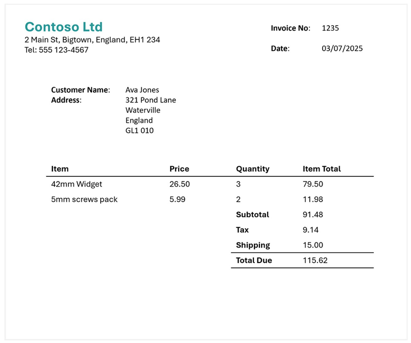

---
lab:
  title: 멀티모달 콘텐츠에서 정보 추출
  description: 'Azure AI 콘텐츠 이해를 사용하여 문서, 이미지, 오디오 녹음 및 비디오에서 인사이트를 추출합니다.'
---

# 멀티모달 콘텐츠에서 정보 추출

이 연습에서는 Azure 콘텐츠 이해를 사용하여 다양한 콘텐츠 형식에서 정보를 추출합니다. 여기에는 송장, 차트가 포함된 슬라이드 이미지, 음성 메시지의 오디오 녹음, 전화 회의 비디오 녹화 등이 포함됩니다.

이 연습은 약 **40**분 정도 소요됩니다.

## Azure AI 파운드리 허브 및 프로젝트 만들기

이 연습에서 사용할 Azure AI 파운드리의 기능에는 Azure AI 파운드리 *허브* 리소스를 기반으로 하는 프로젝트가 필요합니다.

1. 웹 브라우저에서 [Azure AI 파운드리 포털](https://ai.azure.com)(`https://ai.azure.com`)을 열고 Azure 자격 증명을 사용하여 로그인합니다. 처음 로그인할 때 열리는 팁이나 빠른 시작 창을 닫고, 필요한 경우 왼쪽 위에 있는 **Azure AI 파운드리** 로고를 사용하여 다음 이미지와 유사한 홈페이지로 이동합니다(**도움말** 창이 열려 있는 경우 닫습니다).

    

1. 브라우저에서 `https://ai.azure.com/managementCenter/allResources`로 이동하여 **새로 만들기**를 선택합니다. 그런 다음 새 **AI 허브 리소스**를 만드는 옵션을 선택합니다.
1. **프로젝트 만들기** 마법사에서 유효한 프로젝트 이름을 입력하고 새 허브를 만드는 옵션을 선택합니다. 그런 다음 **허브 이름 바꾸기** 링크를 사용하여 새 허브의 유효한 이름을 지정하고 **고급 옵션**을 확장한 후 프로젝트에 대해 다음 설정을 지정합니다.
    - **구독**: ‘Azure 구독’
    - **리소스 그룹**: ‘리소스 그룹 만들기 또는 선택’
    - **지역**:  다음 위치 중 하나를 선택합니다(*작성 시 Azure AI 콘텐츠 이해는 이러한 지역에서만 사용할 수 있음)*.
        - 오스트레일리아 동부
        - 스웨덴 중부
        - 미국 서부

    > **참고**: 허용 가능한 리소스 이름을 제한하는 정책이 포함된 Azure 구독에서 작업하는 경우 **새 프로젝트 만들기** 대화 상자 아래 있는 링크를 사용하여 Azure Portal을 통해 허브를 만들어야 할 수도 있습니다.

    > **팁**: **만들기** 단추가 여전히 사용하지 않도록 설정된 경우 허브 이름을 고유한 영숫자 값으로 바꿔야 합니다.

1. 프로젝트가 만들어질 때까지 기다립니다.

##  콘텐츠 다운로드

분석하려는 콘텐츠는 .zip 보관에 있습니다. 다운로드하고 로컬 폴더에서 추출합니다.

1. 새 브라우저 탭에서 `https://github.com/microsoftlearning/mslearn-ai-information-extraction/raw/main/Labfiles/content/content.zip`의 [content.zip](https://github.com/microsoftlearning/mslearn-ai-information-extraction/raw/main/Labfiles/content/content.zip)을 다운로드하여 로컬 폴더에 저장합니다.
1. 다운로드한 *content.zip* 파일을 추출하여 포함된 파일을 확인합니다. 이 연습에서는 이러한 파일을 사용하여 다양한 콘텐츠 이해 분석기를 빌드합니다.

> **참고**: 특정 형식(문서, 이미지, 비디오 또는 오디오)의 분석만 살펴보려면 아래 관련 작업으로 건너뛸 수 있습니다. 최상의 환경을 위해 각 작업을 진행하여 다양한 유형의 콘텐츠에서 정보를 추출하는 방법을 알아봅니다.

## 송장 문서에서 정보 추출

송장에서 정보를 추출할 수 있는 Azure AI 콘텐츠 이해 분석기를 빌드하려고 합니다. 먼저 송장 양식에 따라 스키마를 정의합니다.

### 송장 분석을 위한 스키마 정의

1. Azure AI 파운드리 프로젝트의 홈페이지가 포함된 브라우저 탭에서 왼쪽 탐색 창에서 **콘텐츠 이해**를 선택합니다.
1. **콘텐츠 이해** 페이지에서 상단에 있는 **사용자 지정 작업** 탭을 선택합니다.
1. 콘텐츠 이해 사용자 지정 작업 페이지에서 **+ 만들기**를 선택하고 다음 설정으로 작업을 만듭니다.
    - **작업 이름**: `Invoice analysis`
    - **설명**: `Extract data from an invoice`
    - **단일 파일 콘텐츠 분석**: *선택*
    - **고급 설정**:
        - **Azure AI 서비스 연결**: *Azure AI Foundry 허브의 Azure AI 서비스 리소스*
        - **Azure Blob Storage 계정**: *Azure AI 파운드리 허브의 기본 스토리지 계정*
1. 작업이 만들어지는 동안 기다립니다.

    > **팁**: 스토리지에 액세스하는 동안 오류가 발생하면 잠시 기다렸다가 다시 시도합니다. 새 허브에 대한 사용 권한을 전파하는 데 몇 분 정도 걸릴 수 있습니다.

1. **스키마 정의** 페이지에서 콘텐츠 파일을 추출한 **폴더에서 invoice-1234.pdf** 파일을 업로드합니다. 이 파일에는 다음 송장가 포함되어 있습니다.

    

1. **스키마 정의** 페이지에서 송장 파일을 업로드한 후 **송장 데이터 추출** 템플릿을 선택하고 **만들기**를 선택합니다.

    *송장 분석* 템플릿에는 송장에서 흔히 볼 수 있는 필드가 포함되어 있습니다. 스키마 편집기를 사용하여 필요하지 않은 제안된 필드를 삭제하고 필요한 사용자 지정 필드를 추가할 수 있습니다.

1. 제안된 필드 목록에서 **BillingAddress**를 선택합니다. 이 필드는 업로드한 송장 형식에 필요하지 않으므로 선택한 필드 행에 표시되는 **필드 삭제** (**&#128465;**) 아이콘을 사용하여 삭제할 수 있습니다.
1. 이제 송장 스키마에 필요하지 않은 다음과 같은 제안된 필드를 삭제합니다.
    - BillingAddressRecipient
    - CustomerAddressRecipient
    - 고객 ID
    - CustomerTaxId
    - DueDate
    - InvoiceTotal
    - PaymentTerm
    - PreviousUnpaidBalance
    - PurchaseOrder
    - RemittanceAddress
    - RemittanceAddressRecipient
    - ServiceAddress
    - ServiceAddressRecipient
    - ShippingAddress
    - ShippingAddressRecipient
    - TotalDiscount
    - VendorAddressRecipient
    - VendorTaxId
    - TaxDetails
1. **+ 새 필드 추가** 단추를 사용하여 각 새 필드에 대해 **변경 내용 저장**(**&#10003;**)을 선택하여 다음 필드를 추가합니다.

    | 필드 이름 | 필드 설명 | 값 유형 | 메서드 |
    |--|--|--|--|
    | `VendorPhone` | `Vendor telephone number` | 문자열 | Extract |
    | `ShippingFee` | `Fee for shipping` | number | Extract |

1. **항목** 필드 행에서 이 필드는 *테이블*(송장의 항목 컬렉션 포함)임을 확인하세요. **편집** (&#9638;) 아이콘을 선택하여 하위 필드가 있는 새 페이지를 엽니다.
1. **항목** 테이블에서 다음 하위 필드를 제거합니다.
    - 날짜
    - ProductCode
    - 단위
    - TaxAmount
    - TaxRate
1. **확인** 단추를 사용하여 변경 내용을 확인하고 송장 스키마의 최상위 수준으로 돌아갑니다.

1. 완료된 스키마가 다음과 같은지 확인한 다음 **저장**을 선택합니다.

    

1. **테스트 분석기** 페이지에서 분석이 자동으로 시작되지 않으면 **분석 실행**을 선택합니다. 분석을 완료할 때까지 기다립니다.

1. 분석 결과를 검토하면 다음과 비슷하게 보일 것입니다.

    

1. **필드** 창에서 식별된 필드의 세부 정보를 확인합니다.

### 송장에 대한 분석기 빌드 및 테스트

이제 송장에서 필드를 추출하는 모델을 학습시켰으므로 유사한 문서에 사용할 분석기를 빌드할 수 있습니다.

1. **분석기 목록** 페이지를 선택한 다음 **+ 분석기 빌드**를 선택하고 다음 속성을 사용하여 새 분석기를 빌드합니다(여기에 표시된 대로 정확하게 입력).
    - **이름**: `invoice-analyzer`
    - **설명**: `Invoice analyzer`
1. 새 분석기가 준비될 때까지 기다립니다(**새로 고침** 단추를 사용하여 확인).
1. 분석기가 빌드되면 **송장 분석기** 링크를 선택합니다. 분석기 스키마에 정의된 필드가 표시됩니다.
1. **송장 분석기** 페이지에서 **테스트** 탭을 선택합니다.
1. **+ 테스트 파일 업로드** 단추를 사용하여 콘텐츠 파일을 추출한 폴더에서 **invoice-1235.pdf**를 업로드하고, **분석 실행**을 클릭하여 송장에서 필드 데이터를 추출합니다.

    분석 중인 송장은 다음과 같습니다.

    

1. **필드** 창을 검토하고 분석기가 테스트 송장에서 올바른 필드를 추출했는지 확인합니다.
1. **결과** 창을 검토하여 분석기가 클라이언트 애플리케이션에 반환할 JSON 응답을 확인합니다.
1. **코드 예제** 탭에서 콘텐츠 이해 REST 인터페이스를 사용하여 분석기를 호출하는 클라이언트 애플리케이션을 개발하는 데 사용할 수 있는 샘플 코드를 확인합니다.
1. **송장 분석기** 페이지를 닫습니다.

## 슬라이드 이미지에서 정보 추출

차트가 포함된 슬라이드에서 정보를 추출할 수 있는 Azure AI 콘텐츠 이해 분석기를 빌드하려고 합니다.

### 이미지 분석을 위한 스키마 정의

1. Azure AI 파운드리 프로젝트의 홈페이지가 포함된 브라우저 탭에서 왼쪽 탐색 창에서 **콘텐츠 이해**를 선택합니다.
1. **콘텐츠 이해** 페이지에서 상단에 있는 **사용자 지정 작업** 탭을 선택합니다.
1. 콘텐츠 이해 사용자 지정 작업 페이지에서 **+ 만들기**를 선택하고 다음 설정으로 작업을 만듭니다.
    - **작업 이름**: `Slide analysis`
    - **설명**: `Extract data from an image of a slide`
    - **단일 파일 콘텐츠 분석**: *선택*
    - **고급 설정**:
        - **Azure AI 서비스 연결**: *Azure AI Foundry 허브의 Azure AI 서비스 리소스*
        - **Azure Blob Storage 계정**: *Azure AI 파운드리 허브의 기본 스토리지 계정*
1. 작업이 만들어지는 동안 기다립니다.

    > **팁**: 스토리지에 액세스하는 동안 오류가 발생하면 잠시 기다렸다가 다시 시도합니다. 새 허브에 대한 사용 권한을 전파하는 데 몇 분 정도 걸릴 수 있습니다.

1. **스키마 정의** 페이지에서 콘텐츠 파일을 추출한 **폴더에서 slide-1.jpg** 파일을 업로드합니다. 그런 다음 **이미지 분석** 템플릿을 선택하고 **만들기**를 선택합니다.

    *이미지 분석* 템플릿에는 미리 정의된 필드가 포함되어 있지 않습니다. 추출하려는 정보를 설명하는 필드를 정의해야 합니다.

1. **+ 새 필드 추가** 단추를 사용하여 각 새 필드에 대해 **변경 내용 저장**(**&#10003;**)을 선택하여 다음 필드를 추가합니다.

    | 필드 이름 | 필드 설명 | 값 유형 | 메서드 |
    |--|--|--|--|
    | `Title` | `Slide title` | 문자열 | 생성 |
    | `Summary` | `Summary of the slide` | 문자열 | 생성 |
    | `Charts` | `Number of charts on the slide` | 정수 | 생성 |

1. **+ 새 필드 추가** 단추를 사용하여 설명 `Revenue per quarter`, 값 형식 **테이블**과 함께 명명된 `QuarterlyRevenue`새 필드를 추가하고 새 필드(**&#10003;**)를 저장합니다. 그런 다음 열리는 테이블 하위 필드에 대한 새 페이지에서 다음 하위 필드를 추가합니다.

    | 필드 이름 | 필드 설명 | 값 유형 | 메서드 |
    |--|--|--|--|
    | `Quarter` | `Which quarter?` | 문자열 | 생성 |
    | `Revenue` | `Revenue for the quarter` | number | 생성 |

1. **뒤로**(**새 하위 필드 추가** 버튼 근처의 화살표 아이콘) 또는 **&#10003; 확인**을 선택하여 스키마의 최상위 수준으로 돌아간 다음, **+ 새 필드 추가** 버튼을 사용하여 설명 `Product categories`, 값 유형 **테이블**을 가진 이름이 `ProductCategories`인 새 필드를 추가하고 새 필드(**&#10003;**)를 저장합니다. 그런 다음 열리는 테이블 하위 필드에 대한 새 페이지에서 다음 하위 필드를 추가합니다.

    | 필드 이름 | 필드 설명 | 값 유형 | 메서드 |
    |--|--|--|--|
    | `ProductCategory` | `Product category name` | 문자열 | 생성 |
    | `RevenuePercentage` | `Percentage of revenue` | number | 생성 |

1. **뒤로**(**새 하위 필드 추가** 단추 근처의 화살표 아이콘) 또는 **&#10003; 확인**을 선택하여 스키마의 최상위 수준으로 돌아가서 다음과 같은지 확인하세요. 그런 다음 **저장**을 선택합니다.

    

1. **테스트 분석기** 페이지에서 분석이 자동으로 시작되지 않으면 **분석 실행**을 선택합니다. 분석을 완료할 때까지 기다립니다.

    분석 중인 슬라이드는 다음과 같습니다.

    

1. 분석 결과를 검토하면 다음과 비슷하게 보일 것입니다.

    

1. **필드** 창에서 식별된 필드의 세부 정보를 보고 **QuarterlyRevenue** 및 **ProductCategories** 필드를 확장하여 하위 필드 값을 확인합니다.

### 분석기 빌드 및 테스트

이제 슬라이드에서 필드를 추출하는 모델을 학습했으므로 유사한 슬라이드 이미지에 사용할 분석기를 빌드할 수 있습니다.

1. **분석기 목록** 페이지를 선택한 다음 **+ 분석기 빌드**를 선택하고 다음 속성을 사용하여 새 분석기를 빌드합니다(여기에 표시된 대로 정확하게 입력).
    - **이름**: `slide-analyzer`
    - **설명**: `Slide image analyzer`
1. 새 분석기가 준비될 때까지 기다립니다(**새로 고침** 단추를 사용하여 확인).
1. 분석기가 빌드되면 **슬라이드 분석기** 링크를 선택합니다. 분석기 스키마에 정의된 필드가 표시됩니다.
1. **슬라이드 분석기** 페이지에서 **테스트** 탭을 선택하세요.
1. **+ 테스트 파일 업로드** 단추를 사용하여 콘텐츠 파일을 추출한 폴더에서 **slide-2.jpg**를 업로드하고, **분석 실행**을 클릭하여 이미지에서 필드 데이터를 추출합니다.

    분석 중인 슬라이드는 다음과 같습니다.

    

1. **필드** 창을 검토하고 분석기가 슬라이드 이미지에서 올바른 필드를 추출했는지 확인합니다.

    > **참고**: 슬라이드 2에는 제품 범주별 중단이 포함되지 않으므로 제품 범주 수익 데이터를 찾을 수 없습니다.

1. **결과** 창을 검토하여 분석기가 클라이언트 애플리케이션에 반환할 JSON 응답을 확인합니다.
1. **코드 예제** 탭에서 콘텐츠 이해 REST 인터페이스를 사용하여 분석기를 호출하는 클라이언트 애플리케이션을 개발하는 데 사용할 수 있는 샘플 코드를 확인합니다.
1. **슬라이드 분석기** 페이지를 닫습니다.

## 음성 사서함 오디오 녹음에서 정보 추출

음성 메일 메시지의 오디오 녹음에서 정보를 추출할 수 있는 Azure AI 콘텐츠 이해 분석기를 빌드하려고 합니다.

### 오디오 분석을 위한 스키마 정의

1. Azure AI 파운드리 프로젝트의 홈페이지가 포함된 브라우저 탭에서 왼쪽 탐색 창에서 **콘텐츠 이해**를 선택합니다.
1. **콘텐츠 이해** 페이지에서 상단에 있는 **사용자 지정 작업** 탭을 선택합니다.
1. 콘텐츠 이해 사용자 지정 작업 페이지에서 **+ 만들기**를 선택하고 다음 설정으로 작업을 만듭니다.
    - **작업 이름**: `Voicemail analysis`
    - **설명**: `Extract data from a voicemail recording`
    - **단일 파일 콘텐츠 분석**: *선택*
    - **고급 설정**:
        - **Azure AI 서비스 연결**: *Azure AI Foundry 허브의 Azure AI 서비스 리소스*
        - **Azure Blob Storage 계정**: *Azure AI 파운드리 허브의 기본 스토리지 계정*
1. 작업이 만들어지는 동안 기다립니다.

    > **팁**: 스토리지에 액세스하는 동안 오류가 발생하면 잠시 기다렸다가 다시 시도합니다. 새 허브에 대한 사용 권한을 전파하는 데 몇 분 정도 걸릴 수 있습니다.

1. **스키마 정의** 페이지에서 콘텐츠 파일을 추출한 폴더에서 **call-1.mp3** 파일을 업로드합니다. 그런 다음 **음성 기록 분석** 템플릿을 선택하고 **만들기**를 선택합니다.
1. 오른쪽의 **콘텐츠** 창에서 **녹음된 메시지의 대화 내용 기록을 미리 보기**를 선택하여 녹음된 메시지의 대화 내용 기록을 확인하세요.

    *음성 대화록 분석* 템플릿에는 미리 정의된 필드가 포함되어 있지 않습니다. 추출하려는 정보를 설명하는 필드를 정의해야 합니다.

1. **+ 새 필드 추가** 단추를 사용하여 각 새 필드에 대해 **변경 내용 저장**(**&#10003;**)을 선택하여 다음 필드를 추가합니다.

    | 필드 이름 | 필드 설명 | 값 유형 | 메서드 |
    |--|--|--|--|
    | `Caller` | `Person who left the message` | 문자열 | 생성 |
    | `Summary` | `Summary of the message` | 문자열 | 생성 |
    | `Actions` | `Requested actions` | 문자열 | 생성 |
    | `CallbackNumber` | `Telephone number to return the call` | 문자열 | 생성 |
    | `AlternativeContacts` | `Alternative contact details` | 문자열 목록 | 생성 |

1. 스키마가 다음과 같은지 확인합니다. 그런 다음 **저장**을 선택합니다.

    

1. **테스트 분석기** 페이지에서 분석이 자동으로 시작되지 않으면 **분석 실행**을 선택합니다. 분석을 완료할 때까지 기다립니다.

    오디오 분석에는 다소 시간이 걸릴 수 있습니다. 기다리는 동안 아래 오디오 파일을 재생할 수 있습니다.

    <video controls src="https://github.com/MicrosoftLearning/mslearn-ai-information-extraction/raw/refs/heads/main/Instructions/Labs/media/call-1.mp4" title="셀 1" width="300">
        <track src="https://github.com/MicrosoftLearning/mslearn-ai-information-extraction/raw/refs/heads/main/Instructions/Labs/media/call-1.vtt" kind="captions" srclang="en" label="English">
    </video>

    **참고**: 이 오디오는 AI를 사용하여 만들어졌습니다.

1. 분석 결과를 검토하면 다음과 비슷하게 보일 것입니다.

    

1. **필드** 창에서 식별된 필드의 세부 정보를 보고, **AlternativeContacts** 필드를 확장하여 나열된 값을 확인합니다.

### 분석기 빌드 및 테스트

이제 음성 메시지에서 필드를 추출하는 모델을 학습했으므로 비슷한 오디오 녹음에 사용할 분석기를 빌드할 수 있습니다.

1. **분석기 목록** 페이지를 선택한 다음 **+ 분석기 빌드**를 선택하고 다음 속성을 사용하여 새 분석기를 빌드합니다(여기에 표시된 대로 정확하게 입력).
    - **이름**: `voicemail-analyzer`
    - **설명**: `Voicemail audio analyzer`
1. 새 분석기가 준비될 때까지 기다립니다(**새로 고침** 단추를 사용하여 확인).
1. 분석기가 빌드되면 **음성 메일 분석기** 링크를 선택합니다. 분석기 스키마에 정의된 필드가 표시됩니다.
1. **음성 메일 분석기** 페이지에서 **테스트** 탭을 선택합니다.
1. **+ 테스트 파일 업로드** 단추를 사용하여 콘텐츠 파일을 추출한 폴더에서 **call-2.mp3**를 업로드하고, **분석 실행**을 클릭하여 오디오 파일에서 필드 데이터를 추출합니다.

    오디오 분석에는 다소 시간이 걸릴 수 있습니다. 기다리는 동안 아래 오디오 파일을 재생할 수 있습니다.

    <video controls src="https://github.com/MicrosoftLearning/mslearn-ai-information-extraction/raw/refs/heads/main/Instructions/Labs/media/call-2.mp4" title="호출 2" width="300">
        <track src="https://github.com/MicrosoftLearning/mslearn-ai-information-extraction/raw/refs/heads/main/Instructions/Labs/media/call-2.vtt" kind="captions" srclang="en" label="English">
    </video>

    **참고**: 이 오디오는 AI를 사용하여 만들어졌습니다.

1. **필드** 창을 검토하고 분석기가 음성 메시지에서 올바른 필드를 추출했는지 확인합니다.
1. **결과** 창을 검토하여 분석기가 클라이언트 애플리케이션에 반환할 JSON 응답을 확인합니다.
1. **코드 예제** 탭에서 콘텐츠 이해 REST 인터페이스를 사용하여 분석기를 호출하는 클라이언트 애플리케이션을 개발하는 데 사용할 수 있는 샘플 코드를 확인합니다.
1. **음성 메일 분석기** 페이지를 닫습니다.

## 비디오 전화 회의 녹화에서 정보 추출

전화 회의의 비디오 녹음에서 정보를 추출할 수 있는 Azure AI 콘텐츠 이해 분석기를 빌드하려고 합니다.

### 비디오 분석을 위한 스키마 정의

1. Azure AI 파운드리 프로젝트의 홈페이지가 포함된 브라우저 탭에서 왼쪽 탐색 창에서 **콘텐츠 이해**를 선택합니다.
1. **콘텐츠 이해** 페이지에서 상단에 있는 **사용자 지정 작업** 탭을 선택합니다.
1. 콘텐츠 이해 사용자 지정 작업 페이지에서 **+ 만들기**를 선택하고 다음 설정으로 작업을 만듭니다.
    - **작업 이름**: `Conference call video analysis`
    - **설명**: `Extract data from a video conference recording`
    - **단일 파일 콘텐츠 분석**: *선택*
    - **고급 설정**:
        - **Azure AI 서비스 연결**: *Azure AI Foundry 허브의 Azure AI 서비스 리소스*
        - **Azure Blob Storage 계정**: *Azure AI 파운드리 허브의 기본 스토리지 계정*
1. 작업이 만들어지는 동안 기다립니다.

    > **팁**: 스토리지에 액세스하는 동안 오류가 발생하면 잠시 기다렸다가 다시 시도합니다. 새 허브에 대한 사용 권한을 전파하는 데 몇 분 정도 걸릴 수 있습니다.

1. **스키마 정의** 페이지에서 콘텐츠 파일을 추출한 폴더에서 **meeting-1.mp4** 파일을 업로드합니다. 그런 다음 **비디오 분석** 템플릿을 선택하고 **만들기**를 선택합니다.
1. 오른쪽의 **콘텐츠** 창에서 **녹음된 메시지의 대화 내용 기록을 미리 보기**를 선택하여 녹음된 메시지의 대화 내용 기록을 확인하세요.

    *비디오 분석* 템플릿은 비디오에 대한 데이터를 추출합니다. 미리 정의된 필드는 포함되지 않습니다. 추출하려는 정보를 설명하는 필드를 정의해야 합니다.

1. **+ 새 필드 추가** 단추를 사용하여 각 새 필드에 대해 **변경 내용 저장**(**&#10003;**)을 선택하여 다음 필드를 추가합니다.

    | 필드 이름 | 필드 설명 | 값 유형 | 메서드 |
    |--|--|--|--|
    | `Summary` | `Summary of the discussion` | 문자열 | 생성 |
    | `Participants` | `Count of meeting participants` | 정수 | 생성 |
    | `ParticipantNames` | `Names of meeting participants` | 문자열 목록 | 생성 |
    | `SharedSlides` | `Descriptions of any PowerPoint slides presented` | 문자열 목록 | 생성 |
    | `AssignedActions` | `Tasks assigned to participants` | 테이블 |  |

1. **AssignedActions** 필드를 입력하면 표시되는 하위 필드 테이블에서 다음 하위 필드를 만듭니다.

    | 필드 이름 | 필드 설명 | 값 유형 | 메서드 |
    |--|--|--|--|
    | `Task` | `Description of the task` | 문자열 | 생성 |
    | `AssignedTo` | `Who the task is assigned to` | 문자열 | 생성 |

1. **뒤로**(**새 하위 필드 추가** 단추 근처의 화살표 아이콘) 또는 **&#10003; 확인**을 선택하여 스키마의 최상위 수준으로 돌아가서 다음과 같은지 확인하세요. 그런 다음 **저장**을 선택합니다.

1. 스키마가 다음과 같은지 확인합니다. 그런 다음 **저장**을 선택합니다.

    

1. **테스트 분석기** 페이지에서 분석이 자동으로 시작되지 않으면 **분석 실행**을 선택합니다. 분석을 완료할 때까지 기다립니다.

    비디오 분석에는 다소 시간이 걸릴 수 있습니다. 기다리는 동안 아래 비디오를 볼 수 있습니다.

    <video controls src="https://github.com/MicrosoftLearning/mslearn-ai-information-extraction/raw/refs/heads/main/Instructions/Labs/media/meeting-1.mp4" title="회의 1" width="480">
        <track src="https://github.com/MicrosoftLearning/mslearn-ai-information-extraction/raw/refs/heads/main/Instructions/Labs/media/meeting-1.vtt" kind="captions" srclang="en" label="English">
    </video>

    **참고**: 이 비디오는 AI를 사용하여 만들어졌습니다.

1. 분석이 완료되면 다음과 유사한 결과를 검토합니다.

    

1. **필드** 창에서 추가한 필드를 포함하여 비디오에 대해 추출된 데이터를 확인합니다. 만든 필드 값을 보고 필요에 따라 목록 및 테이블 필드를 확장합니다.

### 분석기 빌드 및 테스트

이제 전화 회의 녹음에서 필드를 추출하는 모델을 학습했으므로 비슷한 비디오와 함께 사용할 분석기를 빌드할 수 있습니다.

1. **분석기 목록** 페이지를 선택한 다음 **+ 분석기 빌드**를 선택하고 다음 속성을 사용하여 새 분석기를 빌드합니다(여기에 표시된 대로 정확하게 입력).
    - **이름**: `conference-call-analyzer`
    - **설명**: `Conference call video analyzer`
1. 새 분석기가 준비될 때까지 기다립니다(**새로 고침** 단추를 사용하여 확인).
1. 분석기가 빌드되면 **전화 회의 분석기** 링크를 선택합니다. 분석기 스키마에 정의된 필드가 표시됩니다.
1. **전화 회의 분석기** 페이지에서 **테스트** 탭을 선택하세요.
1. **테스트 파일 업로드** 단추를 사용하여 콘텐츠 파일을 추출한 폴더에서 **meeting-2.mp4**를 업로드하고, 분석을 실행하여 오디오 파일에서 필드 데이터를 추출합니다.

    비디오 분석에는 다소 시간이 걸릴 수 있습니다. 기다리는 동안 아래 비디오를 볼 수 있습니다.

    <video controls src="https://github.com/MicrosoftLearning/mslearn-ai-information-extraction/raw/refs/heads/main/Instructions/Labs/media/meeting-2.mp4" title="회의 2" width="480">
        <track src="https://github.com/MicrosoftLearning/mslearn-ai-information-extraction/raw/refs/heads/main/Instructions/Labs/media/meeting-2.vtt" kind="captions" srclang="en" label="English">
    </video>

    **참고**: 이 비디오는 AI를 사용하여 만들어졌습니다.

1. **필드** 창을 검토하고 분석기가 전화 회의 비디오에 대해 추출한 필드를 확인합니다.
1. **결과** 창을 검토하여 분석기가 클라이언트 애플리케이션에 반환할 JSON 응답을 확인합니다.
1. **전화 회의 분석기** 페이지를 닫습니다.

## 정리

콘텐츠 이해 서비스에서 작업을 완료한 경우 불필요한 Azure 비용이 발생하지 않도록 이 연습에서 만든 리소스를 삭제해야 합니다.

1. Azure AI Foundry 포털에서 허브로 이동하여 개요 페이지에서 프로젝트를 선택하고 삭제합니다.
1. Azure Portal에서 이 연습용으로 만든 리소스 그룹을 삭제합니다.
