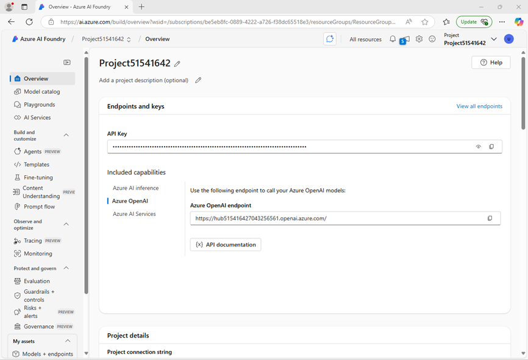

---
lab:
  title: 사전 빌드된 Azure AI 문서 인텔리전스 모델을 사용하여 양식 분석
  description: 미리 빌드된 Azure AI 문서 인텔리전스 모델을 사용하여 문서에서 텍스트 필드를 처리합니다.
---

# 사전 빌드된 Azure AI 문서 인텔리전스 모델을 사용하여 양식 분석

이 연습에서는 문서 분석에 필요한 모든 리소스를 사용하여 Azure AI Foundry 프로젝트를 설정합니다. Azure AI Foundry 포털과 Python SDK를 모두 사용하여 분석을 위해 해당 리소스에 양식을 제출합니다.

이 연습은 Python을 기반으로 하지만 여러 언어별 SDK를 사용하여 유사한 애플리케이션을 개발할 수 있습니다. 포함 사항:

- [Python용 Azure AI 문서 인텔리전스 클라이언트 라이브러리](https://pypi.org/project/azure-ai-formrecognizer/)
- [Microsoft .NET용 Azure AI 문서 인텔리전스 클라이언트 라이브러리](https://www.nuget.org/packages/Azure.AI.FormRecognizer)
- [JavaScript용 Azure AI 문서 인텔리전스 클라이언트 라이브러리](https://www.npmjs.com/package/@azure/ai-form-recognizer)

이 연습에는 약 **30**분이 소요됩니다.

## Azure AI 파운드리 프로젝트 만들기

먼저 Azure AI 파운드리 프로젝트를 만들어 보겠습니다.

1. 웹 브라우저에서 [Azure AI 파운드리 포털](https://ai.azure.com)(`https://ai.azure.com`)을 열고 Azure 자격 증명을 사용하여 로그인합니다. 처음 로그인할 때 열리는 팁이나 빠른 시작 창을 닫고, 필요한 경우 왼쪽 위에 있는 **Azure AI 파운드리** 로고를 사용하여 다음 이미지와 유사한 홈페이지로 이동합니다(**도움말** 창이 열려 있는 경우 닫습니다).

    

1. 브라우저에서 `https://ai.azure.com/managementCenter/allResources`로 이동하여 **새로 만들기**를 선택합니다. 그런 다음 새 **AI 허브 리소스**를 만드는 옵션을 선택합니다.
1. **프로젝트 만들기** 마법사에서 유효한 프로젝트 이름을 입력하고 새 허브를 만드는 옵션을 선택합니다. 그런 다음 **허브 이름 바꾸기** 링크를 사용하여 새 허브의 유효한 이름을 지정하고 **고급 옵션**을 확장한 후 프로젝트에 대해 다음 설정을 지정합니다.
    - **구독**: ‘Azure 구독’
    - **리소스 그룹**: ‘리소스 그룹 만들기 또는 선택’
    - **지역**:  *사용 가능한 모든 지역*

    > **참고**: 허용 가능한 리소스 이름을 제한하는 정책이 포함된 Azure 구독에서 작업하는 경우 **새 프로젝트 만들기** 대화 상자 아래 있는 링크를 사용하여 Azure Portal을 통해 허브를 만들어야 할 수도 있습니다.

    > **팁**: **만들기** 단추가 여전히 사용하지 않도록 설정된 경우 허브 이름을 고유한 영숫자 값으로 바꿔야 합니다.

1. 프로젝트가 만들어질 때까지 기다립니다.
1. 프로젝트를 만들 때 표시되는 팁을 모두 닫고 Azure AI 파운드리 포털에서 프로젝트 페이지를 검토합니다. 이 페이지는 다음 이미지와 유사합니다.

    

## 읽기 모델 사용

**Azure AI Foundry** 포털과 읽기 모델을 사용하여 여러 언어로 된 문서를 분석해 보겠습니다.

1. 왼쪽 탐색 패널에서 **AI 서비스**를 선택합니다.
1. **Azure AI 서비스** 페이지에서 **비전 + 문서** 타일을 선택합니다.
1. **Vision + 문서** 페이지에서 **문서** 탭이 선택되어 있는지 확인한 다음 **OCR/읽기** 타일을 선택합니다.

    **읽기** 페이지에서 프로젝트로 만든 Azure AI 서비스 리소스가 이미 연결되어 있어야 합니다.

1. 왼쪽의 문서 목록에서 **read-german.pdf**를 선택합니다.

    

1. 상단 도구 모음에서 **분석 옵션**을 선택한 다음, **분석 옵션** 창에서 **언어** 확인란을 활성화하고(**선택적 검색** 아래) **저장**을 선택합니다. 
1. 왼쪽 위에서 **분석 실행**을 선택합니다.
1. 분석이 완료되면 이미지에서 추출된 텍스트가 **콘텐츠** 탭의 오른쪽에 표시됩니다. 이 텍스트를 검토하고 정확도를 위해 원본 이미지의 텍스트와 비교합니다.
1. **결과** 탭을 선택합니다. 이 탭에는 추출된 JSON 코드가 표시됩니다. 

## Cloud Shell 앱 개발 준비

이제 Azure 문서 인텔리전스 서비스 SDK를 사용하는 앱을 살펴보겠습니다. Cloud Shell을 사용하여 앱을 개발합니다. 앱의 코드 파일은 GitHub 리포지토리에 제공되었습니다.

이 청구서를 코드로 분석하게 됩니다.


1. Azure AI 파운드리 포털에서 프로젝트의 **개요** 페이지를 봅니다.
1. **엔드포인트 및 키** 영역에서 **Azure AI 서비스** 탭을 선택하고 **API 키**와 **Azure AI 서비스 엔드포인트**를 확인합니다. 이러한 자격 증명을 사용하여 클라이언트 애플리케이션에서 Azure AI 서비스에 연결합니다.
1. 새 브라우저 탭을 엽니다(Azure AI 파운드리 포털을 기존 탭에서 열어 두기). 그런 다음 새 탭에서 [Azure Portal](https://portal.azure.com)(`https://portal.azure.com`)을 열고 메시지가 나타나면 Azure 자격 증명을 사용하여 로그인합니다.
1. 페이지 상단의 검색 창 오른쪽에 있는 **[\>_]** 단추를 사용하여 Azure Portal에서 새 Cloud Shell을 만들고 ***PowerShell*** 환경을 선택합니다. Cloud Shell은 다음과 같이 Azure Portal 아래쪽 창에 명령줄 인터페이스를 제공합니다.

    > **참고**: 이전에 *Bash* 환경을 사용하는 Cloud Shell을 만든 경우 ***PowerShell***로 전환합니다.

1. Cloud Shell 도구 모음의 **설정** 메뉴에서 **클래식 버전으로 이동**을 선택합니다(코드 편집기를 사용하는 데 필요).

    **<font color="red">계속하기 전에 Cloud Shell의 클래식 버전으로 전환했는지 확인합니다.</font>**

1. PowerShell 창에서 다음 명령을 입력하여 이 연습이 포함된 GitHub 리포지토리를 복제합니다.

    ```
   rm -r mslearn-ai-info -f
   git clone https://github.com/microsoftlearning/mslearn-ai-information-extraction mslearn-ai-info
    ```

    > **팁**: CloudShell에 명령을 붙여넣을 때, 출력이 화면 버퍼의 많은 부분을 차지할 수 있습니다. `cls` 명령을 입력해 화면을 지우면 각 작업에 더 집중할 수 있습니다.

    ***선택한 프로그래밍 언어에 대한 단계를 따릅니다.***

1. 리포지토리가 복제된 후 코드 파일이 들어 있는 폴더로 이동합니다.

    ```
   cd mslearn-ai-info/Labfiles/prebuilt-doc-intelligence/Python
    ```

1. Cloud Shell 명령줄 창에서 다음 명령을 입력하여 사용할 라이브러리를 설치합니다.

    ```
   python -m venv labenv
   ./labenv/bin/Activate.ps1
   pip install -r requirements.txt azure-ai-formrecognizer==3.3.3
    ```

1. 제공된 구성 파일을 편집하려면 다음 명령을 입력합니다.

    ```
   code .env
    ```

    코드 편집기에서 파일이 열립니다.

1. 코드 파일에서 **YOUR_ENDPOINT** 및 **YOUR_KEY** 자리 표시자를 Azure AI 서비스 엔드포인트와 해당 API 키(Azure AI Foundry 포털에서 복사)로 바꿉니다.
1. 자리 표시자를 바꾼 후 코드 편집기에서 **CTRL+S** 명령을 사용하여 변경 내용을 저장한 다음 **CTRL+Q** 명령을 사용하여 Cloud Shell 명령줄을 열어둔 채 코드 편집기를 닫습니다.

## Azure 문서 인텔리전스 서비스를 사용할 코드 추가

이제 SDK를 사용하여 pdf 파일을 평가할 준비가 되었습니다.

1. 제공된 앱 파일을 편집하려면 다음 명령을 입력합니다.

    ```
   code document-analysis.py
    ```

    코드 편집기에서 파일이 열립니다.

1. 코드 파일에서 **필요한 라이브러리 가져오기** 설명을 찾아 다음 코드를 추가합니다.

    ```python
   # Add references
   from azure.core.credentials import AzureKeyCredential
   from azure.ai.formrecognizer import DocumentAnalysisClient
    ```

1. **클라이언트 만들기** 설명을 찾아 다음 코드를 추가합니다(올바른 들여쓰기 수준을 유지하도록 주의).

    ```python
   # Create the client
   document_analysis_client = DocumentAnalysisClient(
        endpoint=endpoint, credential=AzureKeyCredential(key)
   )
    ```

1. **송장 분석** 설명을 찾아 다음 코드를 추가합니다.

    ```python
   # Analyse the invoice
   poller = document_analysis_client.begin_analyze_document_from_url(
        fileModelId, fileUri, locale=fileLocale
   )
    ```

1. **사용자에게 송장 정보 표시**라는 설명을 찾아 다음 코드를 추가합니다.

    ```python
   # Display invoice information to the user
   receipts = poller.result()
    
   for idx, receipt in enumerate(receipts.documents):
    
        vendor_name = receipt.fields.get("VendorName")
        if vendor_name:
            print(f"\nVendor Name: {vendor_name.value}, with confidence {vendor_name.confidence}.")

        customer_name = receipt.fields.get("CustomerName")
        if customer_name:
            print(f"Customer Name: '{customer_name.value}, with confidence {customer_name.confidence}.")


        invoice_total = receipt.fields.get("InvoiceTotal")
        if invoice_total:
            print(f"Invoice Total: '{invoice_total.value.symbol}{invoice_total.value.amount}, with confidence {invoice_total.confidence}.")
    ```

1. 코드 편집기에서 **CTRL+S** 명령을 사용하거나 **마우스 오른쪽 단추 클릭 > 저장**을 클릭하여 변경 사항을 저장합니다. 코드에서 오류를 수정해야 하는 경우 코드 편집기를 열어 두되, 명령줄 창을 명확하게 볼 수 있도록 창의 크기를 조정합니다.

1. 명령줄 창에서 다음 명령을 입력하여 애플리케이션을 실행합니다.

    ```
    python document-analysis.py
    ```

프로그램에는 신뢰 수준이 있는 공급업체 이름, 고객 이름, 청구서 합계가 표시됩니다. 보고서 값을 이 섹션의 시작 부분에서 연 샘플 청구서와 비교합니다.

## 정리

Azure 리소스 사용이 완료되면 추가 요금이 발생하지 않도록 [Azure Portal](https://portal.azure.com)(`https://portal.azure.com`)에서 리소스를 삭제해야 합니다.
