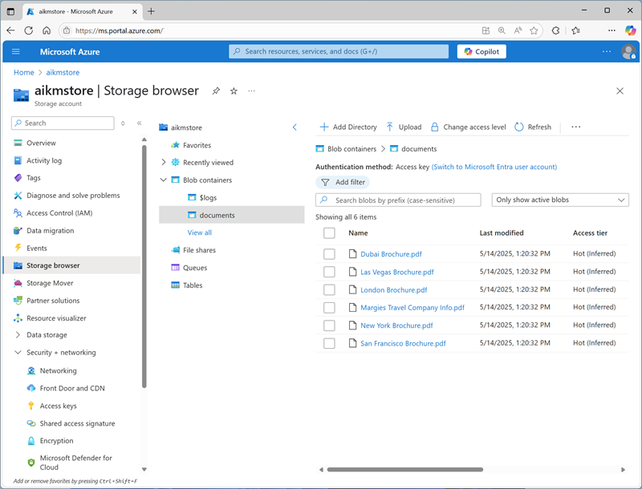

---
lab:
  title: 지식 마이닝 솔루션 만들기
  description: Azure AI 검색을 사용하여 문서에서 주요 정보를 추출하고 더 쉽게 검색하고 분석할 수 있습니다.
---

# 지식 마이닝 솔루션 만들기

이 연습에서는 AI 검색을 사용하여 가상의 여행사인 Margie's Travel에서 유지 관리하는 문서 집합을 인덱싱합니다. 인덱싱 프로세스에는 AI 기술을 사용하여 주요 정보를 추출하여 검색 가능하도록 만들고 추가 분석을 위해 데이터 자산이 포함된 지식 저장소를 만드는 작업이 포함됩니다.

이 연습은 Python을 기반으로 하지만 여러 언어별 SDK를 사용하여 유사한 애플리케이션을 개발할 수 있습니다. 포함 사항:

- [Python용 Azure AI 검색 클라이언트 라이브러리](https://pypi.org/project/azure-search-documents/)
- [Microsoft .NET 대한 Azure AI 검색 클라이언트 라이브러리](https://www.nuget.org/packages/Azure.Search.Documents)
- [JavaScript용 Azure AI 검색 클라이언트 라이브러리](https://www.npmjs.com/package/@azure/search-documents)

이 연습은 약 **40**분 정도 소요됩니다.

## Azure 리소스 만들기

Margie’s Travel을 위해 만들 솔루션에는 Azure 구독의 여러 리소스가 필요합니다. 이 연습에서는 Azure Portal에서 직접 만듭니다. 스크립트 또는 ARM 또는 BICEP 템플릿을 사용하여 만들 수도 있습니다. 또는 Azure AI 검색 리소스를 포함하는 Azure AI Foundry 프로젝트를 만들 수 있습니다.

> **중요**: Azure 리소스는 동일한 위치에 만들어야 합니다.

### Azure AI 검색 리소스 만들기

1. 웹 브라우저에서 `https://portal.azure.com`의 [Azure Portal](https://portal.azure.com)을 열고 Azure 자격 증명을 사용하여 로그인합니다.
1. **&#65291;리소스 만들기** 단추를 선택하고 `Azure AI Search`을(를) 검색한 후 다음 설정으로 **Azure AI 검색** 리소스를 만듭니다.
    - **구독**: ‘Azure 구독’
    - **리소스 그룹**: ‘리소스 그룹 만들기 또는 선택’
    - **서비스 이름**: *검색 리소스의 올바른 이름*
    - **위치**: *사용 가능한 위치*
    - **가격 책정 계층**: 무료

1. 배포가 완료될 때까지 기다린 다음, 배포된 리소스로 이동합니다.
1. Azure Portal에서 Azure AI 검색 리소스에 대한 블레이드의 **개요** 페이지를 검토합니다. 이 페이지에서 시각적 인터페이스를 사용하여 데이터 원본, 인덱스, 인덱서, 기술 세트를 비롯한 검색 솔루션의 다양한 구성 요소 만들기, 테스트, 관리, 모니터링을 수행할 수 있습니다.

### 저장소 계정 만들기

1. 홈 페이지로 돌아가서 다음 설정을 사용하여 **스토리지 계정** 리소스를 만듭니다.
    - **구독**: ‘Azure 구독’
    - **리소스 그룹**: *Azure AI 검색 및 Azure AI 서비스 리소스와 동일한 리소스 그룹입니다*.
    - **스토리지 계정 이름**: *스토리지 리소스의 올바른 이름*
    - **지역**: *Azure AI 검색 리소스와 동일한 지역*
    - **기본 서비스**: Azure Blob Storage 또는 Azure Data Lake Storage Gen 2
    - **성능**: 표준
    - **중복도**: LRS(로컬 중복 스토리지)

1. 배포가 완료될 때까지 기다린 다음, 배포된 리소스로 이동합니다.

    > **팁**: 스토리지 계정 포털 페이지를 열어 두세요. 다음 절차에서 사용합니다.

## Azure Storage에 문서 업로드

지식 마이닝 솔루션은 Azure Storage Blob 컨테이너의 여행 브로슈어 문서에서 정보를 추출합니다.

1. 새 브라우저 탭에서 `https://github.com/microsoftlearning/mslearn-ai-information-extraction/raw/main/Labfiles/knowledge/documents.zip`의 [documents.zip](https://github.com/microsoftlearning/mslearn-ai-information-extraction/raw/main/Labfiles/knowledge/documents.zip)을 다운로드하여 로컬 폴더에 저장합니다.
1. 다운로드한 *documents.zip* 파일을 추출하여 해당 파일에 포함된 여행 브로셔 파일을 확인합니다. 이러한 파일에서 정보를 추출하고 인덱싱합니다.
1. 스토리지 계정에 대한 Azure Portal 페이지가 포함된 브라우저 탭의 왼쪽 탐색 창에서 **스토리지 브라우저**를 선택합니다.
1. 스토리지 브라우저에서 **Blob 컨테이너**를 선택합니다.

    현재 스토리지 계정에는 기본 **$logs** 컨테이너만 포함되어야 합니다.

1. 도구 모음에서 **+ 컨테이너**를 선택하고 다음 설정으로 새 컨테이너를 만듭니다.
    - **이름**: `documents`
    - **익명 액세스 수준** 프라이빗(익명 액세스 없음)\*

    > **참고**: \*스토리지 계정을 만들 때 익명 컨테이너 액세스를 허용하는 옵션을 사용하도록 설정하지 않으면 다른 설정을 선택할 수 없습니다.

1. **문서** 컨테이너를 선택하여 열고, **업로드** 도구 모음 단추를 사용하여 이전에 **documents.zip**에서 추출한 .pdf 파일을 여기에 표시된 대로 컨테이너의 루트에 업로드합니다.

    

## 인덱서 만들기 및 실행

이제 문서가 준비되어 있으므로 인덱서를 만들어 해당 문서에서 정보를 추출할 수 있습니다.

1. Azure Portal에서 Azure AI 검색 리소스를 찾습니다. 그런 다음, **개요** 페이지에서 **데이터 가져오기**를 선택합니다.
1. **데이터에 연결** 페이지의 **데이터 원본**에서 **Azure Blob Storage**를 선택합니다. 그런 다음, 다음 값을 사용하여 데이터 저장소 세부 정보를 완료합니다.
    - 데이터 원본: Azure Blob Storage 선택
    - **데이터 원본 이름**: `margies-documents`
    - **추출할 데이터**: 콘텐츠 및 메타데이터
    - **구문 분석 모드**: 기본값
    - **구독**: ‘Azure 구독’
    - **연결 문자열**: 
        - **기존 연결 선택** 선택
        - 사용자의 스토리지 계정을 선택합니다.
        - **문서** 컨테이너 선택
    - **관리 ID 인증**: 없음
    - **컨테이너 이름**: 문서
    - **Blob 폴더**: *비워둡니다.*
    - **설명**: `Travel brochures`
1. 다음 단계(**인지 기술 추가**)로 진행합니다. 여기에는 완료해야 할 확장 가능한 섹션이 3개 있습니다.
1. **Azure AI 서비스 연결** 섹션에서 **무료(제한된 강화**)\*를 선택합니다.

    > **참고**: \*Azure AI Search용 무료 Azure AI Services 리소스를 사용하여 최대 20개의 문서를 인덱싱할 수 있습니다. 실제 솔루션에서는 구독에 Azure AI 서비스 리소스를 만들어 더 많은 문서에 대한 AI 보강을 사용하도록 설정해야 합니다.

1. **보강 추가** 섹션에서 다음을 수행합니다.
    - **기술 세트 이름**을 `margies-skillset`로(으로) 변경합니다.
    - **OCR 활성화 및 모든 텍스트를 merged_content 필드로 병합** 옵션을 선택합니다.
    - **원본 데이터 필드**가 **merged_content** 설정되었는지 확인합니다.
    - **보강 세분성 수준**은 **원본 필드**로 유지합니다. 원본 필드는 인덱싱하는 문서의 전체 콘텐츠로 설정되어 있습니다. 페이지, 문장 등의 더 세부적인 수준에서 문서를 추출하도록 이 수준을 변경할 수도 있습니다.
    - 다음 보강 필드를 선택합니다.

        | 인지 기술 | 매개 변수 | 필드 이름 |
        | --------------- | ---------- | ---------- |
        | **텍스트 인지 기술** | |  |
        | 사용자 이름 추출 | | people |
        | 위치 이름 추출 | | 위치 |
        | 핵심 구 추출 | | keyphrases |
        | **이미지 인지 기술** | |  |
        | 이미지에서 태그 생성 | | imageTags |
        | 이미지에서 캡션 생성 | | imageCaption |

        선택 항목을 다시 확인합니다(나중에 변경하기 어려울 수 있음).

1. **지식 저장소에 보강 저장**에서 다음을 선택합니다.
    - 다음 확인란만 선택합니다(<font color="red">오류</font>가 표시되고 곧 해결됩니다.)
        - **Azure 파일 프로젝션**:
            - 이미지 프로젝션
        - **Azure 테이블 프로젝션**:
            - 문서
                - 핵심 구
        - **Azure Blob 프로젝션**:
            - Document
    - **스토리지 계정 연결 문자열** 아래(<font color="red">오류 메시지</font> 아래):
        - **기존 연결 선택** 선택
        - 사용자의 스토리지 계정을 선택합니다.
        - **문서** 컨테이너를 선택합니다(*찾아보기 인터페이스에서 스토리지 계정을 선택하는 데만 필요합니다. 추출된 지식 자산에 대해 다른 컨테이너 이름을 지정하게 됩니다!*)
    - **컨테이너 이름**을 `knowledge-store`로(으로) 변경합니다.
1. 다음 단계(**대상 인덱스 사용자 지정**)로 이동하여 인덱스에 대한 필드를 지정합니다. 
1. **인덱스 이름**을 `margies-index`로(으로) 변경합니다.
1. **키**가 **metadata_storage_path**로 설정되어 있는지 확인하고, **제안기 이름**을 비워두고, **검색 모드**가 **analyzingInfixMatching**인지 확인합니다.
1. 인덱스 필드에서 다음 정보를 변경하고 나머지 필드는 모두 기본 설정으로 유지합니다(**중요**: 전체 표를 표시하려면 오른쪽으로 스크롤해야 할 수도 있음).

    | 필드 이름 | 조회 가능 | 필터 가능 | 정렬 가능 | 패싯 가능 | 검색 가능 |
    | ---------- | ----------- | ---------- | -------- | --------- | ---------- |
    | metadata_storage_size | &nbsp;&nbsp;&nbsp;&nbsp;&nbsp;&nbsp;&#10004; | &nbsp;&nbsp;&nbsp;&nbsp;&nbsp;&nbsp;&#10004; | &nbsp;&nbsp;&nbsp;&nbsp;&nbsp;&nbsp;&#10004; | | |
    | metadata_storage_last_modified | &nbsp;&nbsp;&nbsp;&nbsp;&nbsp;&nbsp;&#10004; | &nbsp;&nbsp;&nbsp;&nbsp;&nbsp;&nbsp;&#10004; | &nbsp;&nbsp;&nbsp;&nbsp;&nbsp;&nbsp;&#10004; | | |
    | metadata_storage_name | &nbsp;&nbsp;&nbsp;&nbsp;&nbsp;&nbsp;&#10004; | &nbsp;&nbsp;&nbsp;&nbsp;&nbsp;&nbsp;&#10004; | &nbsp;&nbsp;&nbsp;&nbsp;&nbsp;&nbsp;&#10004; | | &nbsp;&nbsp;&nbsp;&nbsp;&nbsp;&nbsp;&#10004; |
    | 위치 | &nbsp;&nbsp;&nbsp;&nbsp;&nbsp;&nbsp;&#10004; | &nbsp;&nbsp;&nbsp;&nbsp;&nbsp;&nbsp;&#10004; | | | &nbsp;&nbsp;&nbsp;&nbsp;&nbsp;&nbsp;&#10004; |
    | people | &nbsp;&nbsp;&nbsp;&nbsp;&nbsp;&nbsp;&#10004; | &nbsp;&nbsp;&nbsp;&nbsp;&nbsp;&nbsp;&#10004; | | | &nbsp;&nbsp;&nbsp;&nbsp;&nbsp;&nbsp;&#10004; |
    | keyphrases | &nbsp;&nbsp;&nbsp;&nbsp;&nbsp;&nbsp;&#10004; | &nbsp;&nbsp;&nbsp;&nbsp;&nbsp;&nbsp;&#10004; | | | &nbsp;&nbsp;&nbsp;&nbsp;&nbsp;&nbsp;&#10004; |

    선택 항목을 다시 한 번 확인하고 각 필드에 대해 올바른 **조회 가능**, **필터링 가능**, **정렬 가능**, **패싯 가능** 및 **검색 가능** 옵션이 올바르게 선택되었는지 자세히 확인합니다(나중에 이러한 옵션을 변경하기 어려울 수 있음).

1. 다음 단계(**인덱서 만들기**)로 진행하여 인덱서를 만들고 예약합니다.
1. **인덱서 이름**을 `margies-indexer`로(으로) 변경합니다.
1. **일정**을 **한 번**으로 설정된 상태로 둡니다.
1. **제출**을 선택하여 데이터 원본, 기술 세트, 인덱스 및 인덱서를 만듭니다. 인덱서는 자동으로 실행되고 다음과 같은 인덱싱 파이프라인을 실행합니다.
    - 데이터 원본에서 문서 메타데이터 필드 및 콘텐츠 추출
    - 인식 기술의 기술 세트를 실행하여 추가 보강 필드 생성
    - 추출된 필드를 인덱스에 매핑
    - 추출된 데이터 자산을 지식 저장소에 저장합니다.
1. 왼쪽 탐색 창의 **검색 관리**에서 새로 만든 **margies-indexer**가 표시되어야 하는 **인덱서** 페이지를 봅니다. 몇 분 정도 기다렸다가 **상태**가 **성공**으로 표시될 때까지 **&orarr;새로 고침**을 클릭합니다.

## 인덱스 검색

이제 인덱스가 생성되었으므로 해당 인덱스를 검색할 수 있습니다.

1. Azure AI 검색 리소스의 **개요** 페이지로 돌아가서 도구 모음에서 **검색 탐색기**를 선택합니다.
1. 검색 탐색기의 **쿼리 문자열** 상자에 `*`(별표 하나)를 입력한 다음 **검색**을 선택합니다.

    이 쿼리는 인덱스에서 JSON 형식의 모든 문서를 검색합니다. 결과에서 각 문서의 필드를 살펴봅니다. 이러한 필드에는 문서 콘텐츠, 메타데이터, 그리고 선택한 인식 기술이 추출한 보강된 데이터가 포함되어 있습니다.

1. **보기** 메뉴에서 **JSON 보기**를 선택하면 검색에 대한 JSON 요청이 다음과 같이 표시됩니다.

    ```json
    {
      "search": "*",
      "count": true
    }
    ```

1. 이 결과 맨 위에 **@odata.count** 필드가 포함되어 있습니다. 이 필드는 검색에서 반환된 문서 수를 나타냅니다.

1. 여기에 표시된 대로 **select** 매개 변수를 포함하도록 JSON 요청을 수정합니다.

    ```json
    {
      "search": "*",
      "count": true,
      "select": "metadata_storage_name,locations"
    }
    ```

    이번에는 결과에 파일 이름, 문서 콘텐츠에서 언급된 위치만 포함됩니다. 파일 이름은 원본 문서에서 추출된 **metadata_storage_name** 필드에 있습니다. **위치** 필드는 AI 기술에 의해 만들어졌습니다.

1. 이번에는 다음 쿼리 문자열을 사용해 봅니다.

    ```json
    {
      "search": "New York",
      "count": true,
      "select": "metadata_storage_name,keyphrases"
    }
    ```

    이 검색에서는 검색 가능한 필드에 "New York"이 언급된 문서를 찾은 다음 해당 문서의 파일 이름과 핵심 구를 반환합니다.

1. 쿼리를 하나 더 시도해 봅니다.

    ```json
    {
        "search": "New York",
        "count": true,
        "select": "metadata_storage_name,keyphrases",
        "filter": "metadata_storage_size lt 380000"
    }
    ```

    이 쿼리는 크기가 380,000바이트보다 작고 "뉴욕"이 언급된 모든 문서의 파일 이름과 키워드를 반환합니다.

## 검색 클라이언트 애플리케이션 만들기

이제 유용한 인덱스가 생성되었으므로 클라이언트 애플리케이션에서 해당 인덱스를 사용할 수 있습니다. 그러려면 REST 인터페이스를 사용하여 요청을 제출한 다음 HTTP를 통해 JSON 형식 응답을 수신합니다. 원하는 프로그래밍 언어용 SDK(소프트웨어 개발 키트)를 사용해도 됩니다. 이 연습에서는 SDK를 사용합니다.

> **참고**: **C#** 또는 **Python**용 SDK 사용을 선택할 수 있습니다. 아래 단계에서 선호하는 언어에 적합한 작업을 수행하세요.

### 검색 리소스용 엔드포인트 및 키 가져오기

1. Azure Portal에서 검색 탐색기 페이지를 닫고 Azure AI 검색 리소스의 **개요** 페이지로 돌아갑니다.

    **Url** 값은 **https://*your_resource_name*.search.windows.net**과 유사해야 합니다. 이 값이 검색 리소스용 엔드포인트입니다.

1. 왼쪽 탐색 창에서 **설정**을 확장하고 **키** 페이지를 확인하세요.

    **관리자** 키 2개와 **쿼리** 키 1개가 표시됩니다. *관리자* 키는 검색 리소스를 만들고 관리하는 데 사용되며 *쿼리* 키는 검색 쿼리만 수행하면 되는 클라이언트 애플리케이션에 사용됩니다.

    여기서는 *클라이언트 애플리케이션에 대한 엔드포인트 및 **쿼리** 키가 필요합니다.*

### Azure AI 검색 SDK 사용 준비

1. Azure Portal 상단의 검색 창 오른쪽에 있는 **[\>_]** 단추를 사용하여 Azure Portal에 새 Cloud Shell을 만들고 구독에 저장소가 없는 ***PowerShell*** 환경을 선택합니다.

    Cloud Shell은 Azure Portal 하단의 창에서 명령줄 인터페이스를 제공합니다. 보다 쉽게 작업할 수 있도록 이 창의 크기를 조정하거나 최대화할 수 있습니다. 처음에는 Cloud shell과 Azure Portal 모두 확인해야 합니다(필요한 엔드포인트와 키를 찾아 복사할 수 있도록).

1. Cloud Shell 도구 모음의 **설정** 메뉴에서 **클래식 버전으로 이동**을 선택합니다(코드 편집기를 사용하는 데 필요).

    **<font color="red">계속하기 전에 Cloud Shell의 클래식 버전으로 전환했는지 확인합니다.</font>**

1. Cloud Shell 창에서 다음 명령을 입력하여 이 연습의 코드 파일이 포함된 GitHub 리포지토리를 복제합니다(명령을 입력하거나 클립보드에 복사한 다음 명령줄을 마우스 오른쪽 단추로 클릭하고 일반 텍스트로 붙여넣기).

    ```
   rm -r mslearn-ai-info -f
   git clone https://github.com/microsoftlearning/mslearn-ai-information-extraction mslearn-ai-info
    ```

    > **팁**: CloudShell에 명령을 입력하면 출력이 화면 버퍼의 많은 부분을 차지할 수 있습니다. `cls` 명령을 입력해 화면을 지우면 각 작업에 더 집중할 수 있습니다.

1. 리포지토리가 복제된 후 애플리케이션 코드 파일이 포함된 폴더로 이동합니다.

    ```
   cd mslearn-ai-info/Labfiles/knowledge/python
   ls -a -l
    ```

1. 다음 명령을 실행하여 Azure AI 검색 SDK 및 Azure ID 패키지를 설치합니다.

    ```
   python -m venv labenv
   ./labenv/bin/Activate.ps1
   pip install -r requirements.txt azure-identity azure-search-documents==11.5.1
    ```

1. 다음 명령을 실행하여 앱의 구성 파일을 편집합니다.

    ```
   code .env
    ```

    구성 파일이 코드 편집기에서 열립니다.

1. 구성 파일을 편집하여 다음 자리 표시자 값을 바꾸세요.

    - **your_search_endpoint** (*Azure AI 검색 리소스의 엔드포인트로 대체*)
    - **your_query_key** *(Azure AI 검색 리소스의 쿼리 키로 대체*)
    - **your_index_name** (*인덱스 이름으로 바꾸기. 반드시 `margies-index`* 이 되어야 함)

1. 자리 표시자를 업데이트한 후 **CTRL+S** 명령을 사용하여 파일을 저장한 다음 **CTRL+Q** 명령을 사용하여 파일을 닫습니다.

    > **팁**: 이제 Azure Portal에서 엔드포인트 및 키를 복사했으므로 클라우드 셸 창을 최대화하여 작업을 더 쉽게 수행할 수 있습니다.

1. 다음 명령을 실행하여 앱의 코드 파일을 엽니다.

    ```
   code search-app.py
    ```

    코드 편집기에서 코드 파일이 열립니다.

1. 코드를 검토하고 다음 작업을 수행합니다.

    - 편집한 구성 파일에서 Azure AI 검색 리소스 및 인덱스에 대한 구성 설정을 검색합니다.
    - 엔드포인트, 키, 인덱스 이름을 사용하여 **SearchClient**를 만들어 검색 서비스에 연결합니다.
    - 사용자에게 검색 쿼리를 묻는 메시지 표시("종료"를 입력할 때까지)
    - 쿼리를 사용하여 인덱스를 검색하여 다음 필드 반환(metadata_storage_name 기준으로 정렬됨)
        - metadata_storage_name
        - 위치
        - people
        - keyphrases
    - 반환되는 검색 결과를 구문 분석하여 결과 집합의 각 문서에 대해 반환된 필드를 표시합니다.

1. 코드 편집기 창을 닫습니다(*CTRL+Q*). 이때 Cloud shell 명령줄 콘솔 창은 그대로 둡니다.
1. 다음 명령을 입력하여 앱을 실행합니다.

    ```
   python search-app.py
    ```

1. 메시지가 표시되면 `London`와(과) 같은 쿼리를 입력하고 결과를 확인합니다.
1. `flights`와(과) 같은 다른 쿼리를 시도합니다.
1. 앱 테스트가 끝나면 `quit`을(를) 입력하여 앱을 닫습니다.
1. Cloud Shell을 닫고 Azure Portal 돌아갑니다.

## 지식 저장소 확인

기술 세트를 사용하는 인덱서를 실행하여 지식 저장소를 만든 후에는 인덱싱 프로세스에서 추출된 보강 데이터가 지식 저장소 프로젝션에 유지됩니다.

### 개체 프로젝션 보기

Margie’s Travel의 기술 세트에서 정의된 *개체* 프로젝션은 인덱싱된 각 문서에 대한 JSON 파일로 구성됩니다. 해당 파일은 기술 세트 정의에 지정된 Azure Storage 계정의 Blob 컨테이너에 저장됩니다.

1. Azure Portal에서 이전에 만든 Azure Storage 계정을 확인합니다.
1. 왼쪽 창에서 **스토리지 브라우저** 탭을 선택하여 Azure Portal의 스토리지 탐색기 인터페이스에서 스토리지 계정을 확인합니다.
1. **BLOB 컨테이너**를 펼쳐 스토리지 계정의 컨테이너를 표시합니다. 원본 데이터가 저장되는 **documents** 컨테이너 외에도 **knowledge-store** 및 **margies-skillset-image-projection**의 두가지 새 컨테이너가 있어야 합니다. 해당 컨테이너는 인덱싱 프로세스에 의해 생성되었습니다.
1. **knowledge-store** 컨테이너를 선택합니다. 해당 컨테이너에는 인덱싱된 각 문서에 대한 폴더가 포함되어야 합니다.
1. 아무 폴더나 열고, 그 안에 있는 **objectprojection.json** 파일을 선택한 다음 도구 모음의 **다운로드** 단추를 사용하여 파일을 다운로드하고 엽니다. 각 JSON 파일에는 여기에 표시된 대로 기술 세트에서 추출한 보강 데이터를 포함하여 인덱싱된 문서의 표현이 포함되어 있습니다(읽기 쉽도록 형식화됨).

    ```json
    {
        "metadata_storage_content_type": "application/pdf",
        "metadata_storage_size": 388622,
        "<more_metadata_fields>": "...",
        "key_phrases":[
            "Margie’s Travel",
            "Margie's Travel",
            "best travel experts",
            "world-leading travel agency",
            "international reach"
            ],
        "locations":[
            "Dubai",
            "Las Vegas",
            "London",
            "New York",
            "San Francisco"
            ],
        "image_tags":[
            "outdoor",
            "tree",
            "plant",
            "palm"
            ],
        "more fields": "..."
    }
    ```

이와 같이 *개체* 프로젝션을 만드는 기능을 사용하면 엔터프라이즈 데이터 분석 솔루션에 통합할 수 있는 보강된 데이터 개체를 만들 수 있습니다.

### 파일 프로젝션 보기

기술 세트에 정의된 *파일* 프로젝션은 인덱싱 프로세스 중 문서에서 추출된 각 이미지에 대한 JPEG 파일을 만듭니다.

1. Azure Portal의 *스토리지 브라우저* 인터페이스에서 **margies-skillset-image-projection** Blob 컨테이너를 선택합니다. 이 컨테이너는 이미지를 포함하는 각 문서에 대한 폴더를 포함합니다.
2. 폴더를 열고 내용을 확인합니다. 각 폴더에는 하나 이상의 \*.jpg 파일이 포함되어 있습니다.
3. 이미지 파일을 열고 다운로드하여 확인하여 이미지를 확인합니다.

이와 같이 *파일* 프로젝션을 생성하는 기능은 대량의 문서에서 포함된 이미지를 추출하는 효율적인 방법을 제공합니다.

### 테이블 프로젝션 보기

기술 세트에 정의된 *테이블* 프로젝션은 보강 데이터의 관계형 스키마를 형성합니다.

1. Azure Portal의 *스토리지 브라우저* 인터페이스에서 **테이블**을 확장합니다.
2. **margiesSkillsetDocument** 테이블을 선택하여 데이터를 확인하세요. 이 테이블에는 인덱싱된 각 문서에 대한 행이 포함되어 있습니다.
3. 문서에서 추출한 각 핵심 구에 대한 행이 포함된 **margiesSkillsetKeyPhrases** 테이블을 확인하세요.

*테이블* 프로젝션을 만드는 기능을 사용하면 관계형 스키마를 쿼리하는 분석 및 보고 솔루션을 만들 수 있습니다. 자동으로 만들어진 키 열을 사용하여 쿼리에서 테이블을 조인할 수 있습니다. 예를 들어 특정 문서에서 추출한 모든 키 구문을 반환할 수 있습니다.

## 정리

연습을 완료했으므로 더 이상 필요하지 않은 모든 리소스를 삭제합니다. Azure 리소스 삭제:

1. **Azure Portal**에서 리소스 그룹을 선택합니다.
1. 필요하지 않은 리소스 그룹을 선택한 다음 **리소스 그룹 삭제**를 선택합니다.

## 자세한 정보

Azure AI 검색에 대해 자세히 알아보려면 [Azure AI 검색 설명서](https://docs.microsoft.com/azure/search/search-what-is-azure-search)를 참조하세요.
